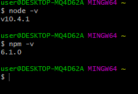
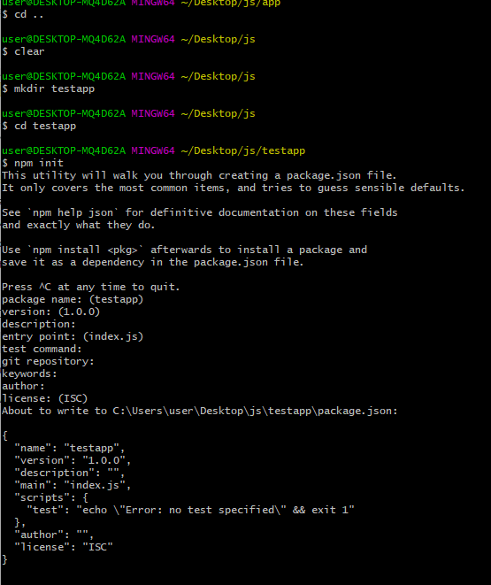
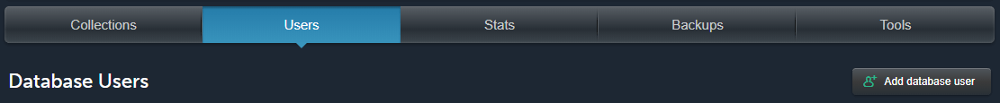
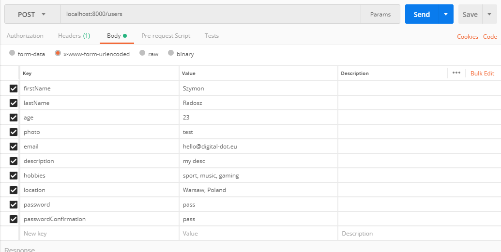
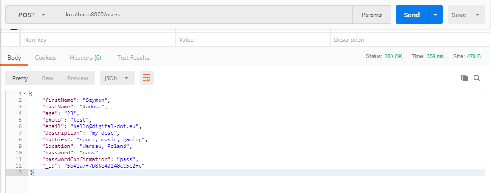
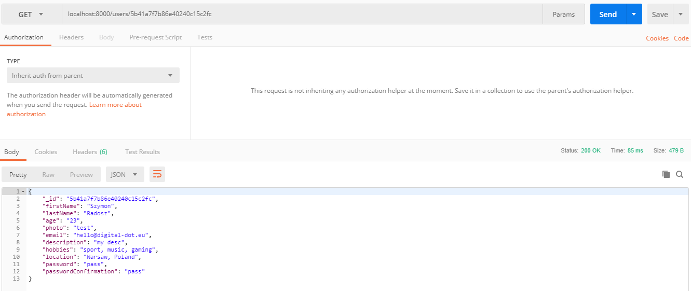

Hi. Today’s post will be dedicated to Node JS. This is an environment that allows us to use Javascript in a slightly different style. Many people identify Javascript as frontend technology(acting on the client/browser side). And what if we can handle all layers of the application with one tool/programming language? Of course, we can write the entire backend using other technologies, we can use great frameworks like Laravel(there are some Laravel enthusiasts here?), Ruby on Rails, ASP .Net etc. However, the desire to build an API, based on which we will build a web and mobile application in the future does not have to involve using technologies other than Javascript. Sounds great?

<h3>What is the API?</h3>

An API can be understood as an independent application that provides other resources to other applications.

Imagine that you are going to a small shop that has some resources/goods. Go through the doorstep where the saleswoman greets you and asks what to give. You do not see exactly how many buns are on the shelf, so you ask for quantity – you do a query to ‘API’. The saleswoman looks at the shelf and responds that there are 10 rolls – ‘API’ returns information. At this point, you created a GET query to the API that returned you the information you wanted because you knew how to communicate with it (ask for bread rolls to get information about bread rolls). To the same ‘API’, or shop, your friend comes in shortly and the saleswoman asks for the same, she looks at the shelf and gives the current number of rolls. At this point, another ‘application’ in the form of your friend has created the same query to the ‘API’ that is the grocery store that returned the data, i.e. the current number of rolls at a given moment.

It’s a bit of an abstract example, but I think that at this point, to some extent, you understand what an API is. It is a separate application that many applications can communicate with and it is able to execute requests for applications communicating with it.

In our case, we will build an API that will be connected to a database (MongoDB). It will be an application in which the user, after registration, will be able to add their events to find people from the area who want to participate in the event in a given place, for example Mark was supposed to go out with friends today to play basketball, but the car broke down and they will not be able to come to him, so Mark adds the event – “The basketball game”, gives co-ordinates where they will play and time. Other users browse the list of events and if they want to join the event. They give the rest of the information in the comments at the event. Having created the API, creating a web and mobile application in the future, the majority of our work will be related to proper communication with our API, which will return information we ask for and send information to it from our applications (eg, the user fills in the registration form and we send this data to the API that adds the user to the database).

<h3>Installing Node JS</h3>

Installation is quite simple for Windows users, download the installer and perform a standard installation.
Installer: https://nodejs.org/en/download/
After installation, we open the console and check if we have successfully installed the Node JS. (I use git bash, but you can also check in plain cmd)

We will notice that ‘npm’ appears here. NPM is a package manager/system for Node JS. With the construction of new applications, we often need new extensions/additions that we can quickly install using the console and npm.

<h3>Creating a project</h3>

In the selected folder, create the ‘testapp’ folder and create the package.json file using the ‘npm init’ command. This is a file that contains information about our project and packages to be installed npm. Parcels/add-ons can take up a lot of space, it would be very inefficient if we would like to send already installed packages, so we can specify their dependencies in package.json and in the future we will install npm install(or npm i) packages that are specified in package.json

With a pre-configured project now, we can start building the API. To start with using npm, we install Express js, Mongo DB and body-parser:

npm install --save express mongodb@2.2.16 body-parser

‘–save’ is used to install and save packages/modules in the package.json file

‘Express’ – Express JS installs for us. Express JS is a Node JS framework for building web applications. You can identify the framework with a tool that allows you to quickly perform certain actions through built-in methods etc.

‘Mongodb’ – this module will help us to work with our database. In this case, we will use MongoDB. This is a no-SQL database (non-relational). This means that we do not have a specific database structure. At the moment you need to know that in MongoDB you have collections (tables in SQL databases), and in collections you have different documents (records in SQL databases). This is a quite inaccurate description, but you must understand that a no-SQL database is a topic for a separate large article.

‘Body-parser’ – we need this to read the data and store them in the facility to which we have access by req.body.

Let’s go to the project and create the main server.js file, the config directory (and the db.js file in it), the app directory(the routes directory in it, and the comment_routes.js, index.js, meet_routes.js, and take_part_routes . js, user_routes.js files inside)

<h3>The structure of the project:</h3>
<pre>
-app
    --routes
        ---comment_routes.js
        ---index.js
        ---meet_routes.js
        ---take_part_routes.js
        ---user_routes.js
-config
    --db.js
-node_modules
-package.json
-package-lock.json
-server.js
</pre>

As I wrote, I will use it as a MongoDB database. Mlab is a service/hosting in which we receive a free 500mb for use in your application/applications. You need to register at https://mlab.com/, after the correct login create a new database, then enter the database, select from the Users panel and create a new user for your database.

<i>config/db.js</i>

<pre>
module.exports = {
    url : 'Your personal Mlab URL'
};
</pre>

Being on the Mlab page with your database at the top of the site you have a link similar to: mongodb://<dbuser>:<dbpassword>@ds11111.mlab.com:11111/YOUR_DB
It should be copied and replaced in the config/db.js file (instead of <dbuser> you give the name of the user you created, and instead of the <dbpassword> password of that user).

Our application is broken down into parts (modules), using module.exports, we export the part that we can use in another file.

<i>server.js</i>

<pre>
const express = require('express');
const MongoClient = require('mongodb').MongoClient;
const bodyParser = require('body-parser');
const db = require('./config/db');
const app = express();
const port = 8000;

app.use(bodyParser.urlencoded({ extended: true }));

MongoClient.connect(db.url, (err, database) => {
    if (err) return console.log(err)
    require('./app/routes')(app, database);

    app.listen(port, () => {
        console.log('We work at ' + port);
    });
});
</pre>

The fact that we installed packages/modules using npm does not mean that we want to use them, we declare it with ‘require’.
We initiate our application via const app=express ();
Using MongoClient, we connect to the database to which we saved the url in the config/db.js file. Our application works locally on port 8000.

<i>app/routes/index.js</i>

<pre>
const meetRoutes = require('./meet_routes');
const userRoutes = require('./user_routes');
const takePartRoutes = require('./take_part_routes');
const commentRoutes = require('./comment_routes');

module.exports = function(app, db) {
    meetRoutes(app, db);
    userRoutes(app, db);
    takePartRoutes(app, db);
    commentRoutes(app, db);
};
</pre>

In this file, we declare variables corresponding to the particular routes.

Now create the following collections in the mLab panel: meetings, takePart, users, comments

<i>app/routes/meet_routes.js</i>

<pre>
module.exports = function(app, db) {
    //list of all meetings
    // under localhost:8000/meetings, we will get a list of our meetings in the application
    // from the collection of the meetings, return all information
    app.get('/meetings', (req,res) => {
        db.collection('meetings').find({}).toArray(function(err, item){
            if(err){
                res.send({ 'error' : 'An error occured' });
            }
            else{
                res.send(item);
            }
        });
    });

    //information about single/particular meeting
    // under localhost:8000/meetings/id We will get information about the meeting
    var ObjectID = require('mongodb').ObjectID;
    app.get('/meetings/:id', (req,res) => {
        const id = req.params.id;
        const details = { '\_id' : new ObjectID(id) };
        
        db.collection('meetings').findOne(details, (err, item) => {
            if(err){
                res.send({ 'error' : 'An error occured' });
            }
            else{
                res.send(item);
            }
        });
    });

    // add a meeting to the database
    // under localhost:8000/meetings, by sending data using POST, we will save them in the database
    // notice that by body-parser using req.body we can send data in our forms
    app.post('/meetings', (req, res) => {
        const note = { title: req.body.title, description: req.body.description, author: req.body.author, lattitude: req.body.lattitude, longitude: req.body.longitude, date: req.body.date, time: req.body.time };

        db.collection('meetings').insert(note, (err, result) => {
            if (err) {
                res.send({ 'error': 'An error has occurred' });
            } else {
                res.send(result.ops[0]);
            }
        });
    });

    //delete meeting
    app.delete('/meetings/:id', (req, res) => {
        const id = req.params.id;
        const details = { '\_id': new ObjectID(id) };
        db.collection('meetings').remove(details, (err, item) => {
            if (err) {
                res.send({'error':'An error has occurred'});
            } else {
                res.send('Meeting ' + id + ' deleted!');
            }
        });
    });

    //update meeting
    app.put('/meetings/:id', (req, res) => {
        const id = req.params.id;
        const details = { '\_id': new ObjectID(id) };
        const note = { title: req.body.title, description: req.body.description, author: req.body.author, lattitude:req.body.lattitude, longitude: req.body.longitude, date: req.body.date };
        
        db.collection('meetings').update(details, note, (err, result) => {
            if (err) {
                res.send({'error':'An error has occurred'});
            } else {
                res.send(note);
            }
        });
    });
};
</pre>

There are various methods in the API that define individual actions. The most important are GET, POST, DELETE, PUT. GET – returns data, POST – sends data, DELETE – removes data and PUT – updates data(in really short introduce).

<i>app/routes/user_routes.js</i>

<pre>
module.exports = function(app, db) {
    app.get('/users', (req,res) => {
        db.collection('users').find({}).toArray(function(err, item){
            if(err){
                res.send({ 'error' : 'An error occured' });
            }
            else{
                res.send(item);
            }
        });
    });

    var ObjectID = require('mongodb').ObjectID;
    app.get('/users/:id', (req,res) => {
        const id = req.params.id;
        const details = { '\_id' : new ObjectID(id) };

        db.collection('users').findOne(details, (err, item) => {
            if(err){
                res.send({ 'error' : 'An error occured' });
            }
            else{
                res.send(item);
            }
        });
    });

    app.post('/users', (req, res) => {
        const user = { firstName: req.body.firstName, lastName: req.body.lastName, age: req.body.age, photo: req.body.photo, email: req.body.email, description: req.body.description, hobbies: req.body.hobbies, location: req.body.location, password: req.body.password, passwordConfirmation: req.body.passwordConfirmation };

        db.collection('users').insert(user, (err, result) => {
            if (err) {
                res.send({ 'error': 'An error has occurred' });
            } else {
                res.send(result.ops[0]);
            }
        });
    });

    app.delete('/users/:id', (req, res) => {
        const id = req.params.id;
        const details = { '\_id': new ObjectID(id) };

        db.collection('users').remove(details, (err, item) => {
            if (err) {
                res.send({'error':'An error has occurred'});
            } else {
                res.send('User ' + id + ' deleted!');
            }
        });
    });

    app.put('/users/:id', (req, res) => {
        const id = req.params.id;
        const details = { '\_id': new ObjectID(id) };
        const note = { firstName: req.body.firstName, lastName: req.body.lastName, age: req.body.age, photo: req.body.photo, email: req.body.email, description: req.body.description, hobbies: req.body.hobbies, location: req.body.location };

        db.collection('users').update(details, note, (err, result) => {
            if (err) {
                res.send({'error':'An error has occurred'});
            } else {
                es.send(note);
            }
        });
    });
};</pre>

<i>app/routes/take_part_routes.js</i>

<pre>
module.exports = function(app, db) {
    var ObjectID = require('mongodb').ObjectID;
    app.get('/takePart/:id', (req,res) => {
        const id = req.params.id;
        const details = { '\_id' : new ObjectID(id) };

        db.collection('takePart').findOne(details, (err, item) => {
            if(err){
                res.send({ 'error' : 'An error occured' });
            }
            else{
                res.send(item);
            }
        });
    });

    app.post('/takePart', (req, res) => {
        const note = { meetingId: req.body.meetingId, userId: req.body.userId };

        db.collection('takePart').insert(note, (err, result) => {
            if (err) {
                res.send({ 'error': 'An error has occurred' });
            } else {
                res.send(result.ops[0]);
            }
        });
    });
};</pre>

If the user write a comment in the event, we need to assign the user id to the meeting id.

<i>app/routes/comment_routes.js</i>

<pre>
module.exports = function(app, db) {
    var ObjectID = require('mongodb').ObjectID;
    app.get('/comments/:id', (req,res) => {
        const id = req.params.id;
        const details = { '\_id' : new ObjectID(id) };

        db.collection('comments').findOne(details, (err, item) => {
            if(err){
                res.send({ 'error' : 'An error occured' });
            }
            else{
                res.send(item);
            }
        });
    });

    app.post('/comments', (req, res) => {
        const note = { meetingId: req.body.meetingId, userId: req.body.userId, date: req.body.date, commentBody: req.body.commentBody };

        db.collection('comments').insert(note, (err, result) => {
            if (err) {
                res.send({ 'error': 'An error has occurred' });
            } else {
                res.send(result.ops[0]);
            }
        });
    });

    app.delete('/comments/:id', (req, res) => {
        const id = req.params.id;
        const details = { '\_id': new ObjectID(id) };

        db.collection('comments').remove(details, (err, item) => {
            if (err) {
                res.send({'error':'An error has occurred'});
            } else {
                res.send('Comment ' + id + ' deleted!');
            }
        });
    });

    app.put('/comments/:id', (req, res) => {
        const id = req.params.id;
        const details = { '\_id': new ObjectID(id) };
        const note = { meetingId: req.body.meetingId, userId: req.body.userId, date: req.body.date, commentBody: req.body.commentBody };
        
        db.collection('comments').update(details, note, (err, result) => {
            if (err) {
                res.send({'error':'An error has occurred'});
            } else {
                res.send(note);
            }
        });
    });
};
</pre>

Having all the files, check the proper operation of our API. Open the console(command line) in the root folder and use the ‘node server.js’ command to start our server. The console should display the information ‘We work at 8000’.

Now, let’s stop for a moment. We’ve created an API, but we do not know if it works.

<h3>How do you test the API?</h3>

You should install Postman – it is a program that will allow us to send queries to our API.
Download it from https://www.getpostman.com/

After entering the program on the left we have a list of queries we can send (we used only GET, POST, DELETE, UPDATE) and a text field to the given address.

At the beginning, let’s add a user to the database to test their return later. Select POST, enter the address localhost 8000/users and in the Body tab select x-www-form-urlencoded where we will provide the parameters we want to send. Enter your parameters/data and Send (‘Send’). Remember that our server.js has to work all the time.

If there are no errors, Postman will return the data you entered in JSON format (“key”:”value” pairs).

Let’s check now in the Mlab database whether the user has been correctly added.

Let’s go to our base in the mLab panel, then to the users collection. We should see a document with our user.

Now let’s test the find of a user with a unique id.
Using the GET query at localhost:8000/users/userID

You can now test the API yourself using Postman.

I placed the source code at: https://github.com/RadoszSzymon/nodeArticle1
You can clone the project, put the address of your database in config / db.js and using ‘npm and’ install the packages needed for the operation of our API.

I hope you enjoyed this article and have aroused your interest in Node JS. There were many details that I had to omit for a simple reason – discussing each side thing in more detail would create a very long article that most people would not want to read.

Bye and have an awesome day.

