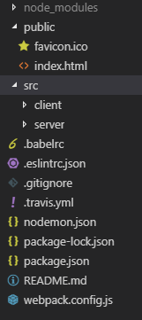
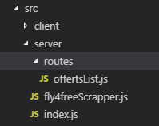
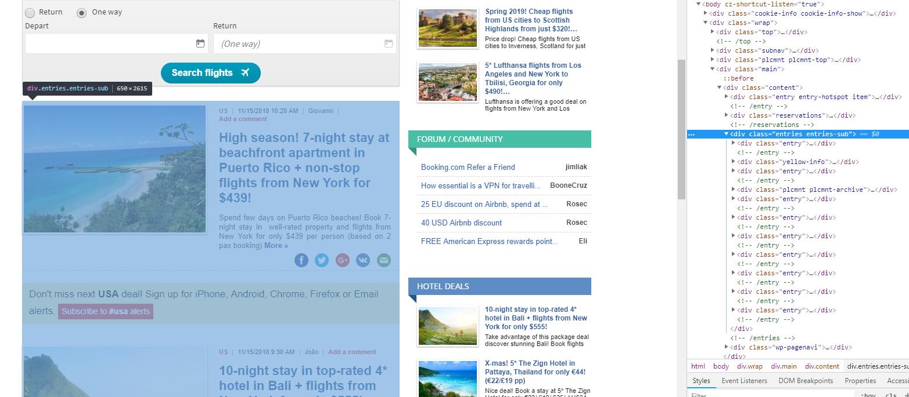
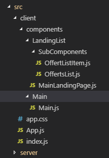

Today I decided to make a tutorial about web scraping using Node.js and Cheerio.js.

We’ll scrap some website with flyies offers, save that in MySQL database and then using React we display results which we got from our db.

Firstly, I show you what the result of that tutorial looks like:

There are current offers with data scraped from website below. This app allows you to display interesting offers from the landing page of the page we’ve scrapped and when you find something interesting deals you can go to the provider page for all details. There’s the form of advertisement for a provider website. We don’t use that data for bad purposes to be clear buddy.

Provider website: https://www.fly4free.com/flights/flight-deals/usa/

<h3>Basic setup</h3>

I decided to use ready boilerplate for our app with Node.js, Express.js and React to speed up our development.

To start that tutorial you should write the post below:

https://hackernoon.com/full-stack-web-application-using-react-node-js-express-and-webpack-97dbd5b9d708

After successfully setting up our boilerplate your project structure should looks like:

src/client is where our frontend part(React) is located and src/server is where our backend(Node.js, Express.js. Cheerio.js) is landed.

<h3>Our Backend functionality</h3>

In src/server we need structure like that:

index.js – main Node.js file

index.js – main Node.js file

index.js – main Node.js file

<h3>DB setup</h3>

You have to create a database called flyscrapper in your phpmyadmin. If you use Windows oparating system, please install XAMPP, run Apache and MySQL and visit localhost/phpmyadmin.

<h3>Scrapper functionality</h3>

<i>server/fly4freeScapper.js</i>

<pre>
const requestPromise = require('request-promise');

const cheerio = require('cheerio');

const url = 'https://www.fly4free.com/flights/flight-deals/usa/';

const mysql = require('mysql');

const con = mysql.createConnection({
  host: "localhost",
  user: "root",
  password: "",
  database: "flyscrapper"
});

var checkIfTableExists = "SHOW TABLES LIKE 'fly4free'";

console.log(checkIfTableExists);

con.query(checkIfTableExists, function (err, result) {

  if (err) throw err;

  console.log(result.length);

  if(result.length == 0){
    con.query("CREATE TABLE fly4free (id int NOT NULL AUTO_INCREMENT, title VARCHAR(255), description VARCHAR(255), page_url VARCHAR(255), img_url VARCHAR(255), PRIMARY KEY (id))", function (err, result) {

      if (err) throw err;

      console.log("Table created");
    });
  }else{
    console.log('table exists');
  }
});

requestPromise(url).then(function(entireWebsiteHtml){
  const result = cheerio('.entries-sub > .entry', entireWebsiteHtml);

  const flyResults = [];

  result.map(i => {

      let title = cheerio('.entries > .entry > .entry__title', entireWebsiteHtml).eq(i).text();

      let description = cheerio('.entries > .entry > .entry__content > p > strong', entireWebsiteHtml).eq(i).text();

      let articleUrl = cheerio('.entries > .entry > .media-photo > a', entireWebsiteHtml)[i].attribs.href;

      let imageUrl = cheerio('.entries > .entry > .media-photo > a > img', entireWebsiteHtml)[i].attribs.src;

      let offertObject = {
        offertTitle: title,
        offertDescription: description,
        offertUrl: articleUrl,
        offertImageUrl: imageUrl
      };

      flyResults.push(offertObject);
  });

  flyResults.map(singleFlyResult => {

      var checkIfRecordExists = "SELECT * FROM fly4free WHERE page_url = '" + singleFlyResult.offertUrl + "' LIMIT 1";

      con.query(checkIfRecordExists, function (err, result) {

        if (err) throw err;

        console.log(result.length);

        if (result.length == 0){

          var sql = "INSERT INTO fly4free (title, description, page_url, img_url) VALUES ('" + singleFlyResult.offertTitle + "', '" + singleFlyResult.offertDescription + "', '" + singleFlyResult.offertUrl + "', '" + singleFlyResult.offertImageUrl + "')";

          con.query(sql, function (err, result) {
            if (err) throw err;
            console.log("record added");
          });
        }

        else{
          console.log("record exists");
        }
  });
});
})
.catch(function(err){
  console.log(err);
});
</pre>

First, we need to declare some additional packages.

Request-promise – used for HTTP request

cheerio – used for load website content

mysql – used for operation on our db

Then we have to check if db table called ‘fly4free’ exists. If that’s false then we need to create table with fields: id(autoincrement), title, description, page_url and img_url to store our results.

Then we need to inspect fly4free website and find in an html structure container of content we are interested.

We found our data in ‘.entries-sub > .entry’. There is single offer on the website. For every offer, we need to scrap title, offer url, image source, and description.

With cheerio we get the content of that html and store that in result const. Then we map every result(every offer container) and store interesting data. We add every offer object to flyResults array.

Then when we have array of all results that’s time to store that results in our db.

For every result in the array first we check if offer doesn’t exists in our database. If that’s true, then we insert that record in our database using SQL query.

<h3>Route for return record from database</h3>

<i>routes/offertsList.js</i>

<pre>
const express = require('express');

const router = express.Router();

const mysql = require('mysql');

const con = mysql.createConnection({
  host: "localhost",
  user: "root",
  password: "",
  database: "flyscrapper"
});

router.get('/offers', function (req, res) {
  con.query("SELECT \* FROM fly4free", function (err, result, fields) {
      if (err) throw err;
      res.send(result);
  });
})

module.exports = router;
</pre>

It’s similar for scrapper code. We connect with our db and for GET request in address /offers we return all records from fly4free table.

<h3>Main Node.js to link everything</h3>

<pre>
const express = require('express');

const os = require('os');

const router = express.Router();

const app = express();

const fly4free = require('./fly4freeScrapper');

app.all('/\*', function(req, res, next) {
  res.header("Access-Control-Allow-Origin", "\*");
  res.header("Access-Control-Allow-Headers", "X-Requested-With");
  next();
});

app.use(express.static('dist'));

app.listen(8080, () => console.log('Listening on port 8080!'));

const offertsList = require('./routes/offertsList');

app.use('/', offertsList);

</pre>

We require to execute fly4freeScrapper.js file with our scrapper. We need also include code to allow CORS. Without that we’ll have troubles with load data from our GET request /offers in React component. At the end of that file we add our route.

<h3>Frontend part</h3>

We got react configured in our boilerplate. We need following files/directories structure for our frontend.

<h3>Bootstrap setup</h3>

We add bootstrap to make our app not so ugly.

Add bootstrap package for our package.json

<pre>
npm install --save react-bootstrap
</pre>

We also need to include bootstrap in our public/index.html before our closing body tag.

<pre>
link rel="stylesheet" href="https://maxcdn.bootstrapcdn.com/bootstrap/3.3.7/css/bootstrap.min.css" integrity="sha384-BVYiiSIFeK1dGmJRAkycuHAHRg32OmUcww7on3RYdg4Va+PmSTsz/K68vbdEjh4u" crossorigin="anonymous">

link rel="stylesheet" href="https://maxcdn.bootstrapcdn.com/bootstrap/3.3.7/css/bootstrap-theme.min.css" integrity="sha384-rHyoN1iRsVXV4nD0JutlnGaslCJuC7uwjduW9SVrLvRYooPp2bWYgmgJQIXwl/Sp" crossorigin="anonymous">
</pre>

<i>client/App.js</i>

<pre>
import React, { Component } from 'react';

import './app.css';

import Main from './components/Main/Main';

export default class App extends Component {
  render() {
    return (
        

          <Main />
        

    );
  }
}
</pre>

<i>client/components/Main/Main.js</i>

<pre>
import React, { Component } from 'react';

import MainLandingPage from './../LandingList/MainLandingPage';

class Main extends Component{
  render(){
    return(
        <MainLandingPage />
    )
  }
}
export default Main;
</pre>

<i>client/components/LandingList/MainLandingPage.js</i>

<pre>
import React, { Component } from 'react';

import OffertsList from './SubComponents/OffertsList';

class MainLandingPage extends Component{
  render(){
    return(
        

          <OffertsList />
        

    )
  }
}
export default MainLandingPage;
</pre>

<i>client/components/LandingList/SubComponents.js</i>

<pre>
import React, { Component } from 'react';

import OffertListItem from './OffertListItem';

import axios from 'axios';

class OffertsList extends Component{
  constructor(props){
    super(props);
    this.state ={
        offersList: []
    }
  }

  async componentDidMount(){
    const allOffers = await axios.get(
        `http://localhost:8080/offers`
    );
    await this.setState({offersList: allOffers.data});
  }

  render(){
    return(
        

          {this.state.offersList.map((offer, i) => {
            return(<OffertListItem offer={offer} key={i}/>);
          })}
        

    )
  }
}
export default OffertsList;
</pre>

In that component we load GET request /offers content using axios and store that in our state variable – offersList. Then we map through all offersList items and send data to OffertListItem with is component displayed single offer in our app.

To install axios run in terminal:

<pre>
npm install axios --save
</pre>

<i>client/components/LandingList/OffertListItem.js</i>

<pre>
import React, { Component } from 'react';

class OffertListItem extends Component{
  constructor(props){
    super(props);
  }

  render(){
    return(
        div className="row">
          a href={this.props.offer.page_url}>
            div className="col-sm-4">
              img src={this.props.offer.img_url} />
            /div>
            div className="col-sm-8">
              h1>{this.props.offer.title}/h1>
              p>{this.props.offer.description}/p>
            /div>
          /a>
        /div>
    )
  }

}
export default OffertListItem;
</pre>

In that component we display data for every offer which we got as props for the previous OffertList component.

And that’s everything. Now every time you run npm run dev, our scrapper check and save data to our database and results are displayed our frontend.

