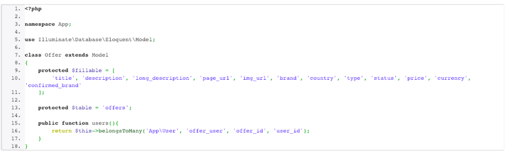
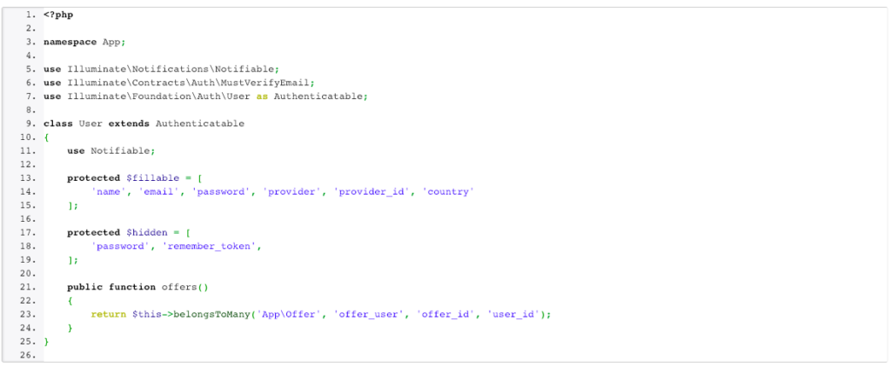
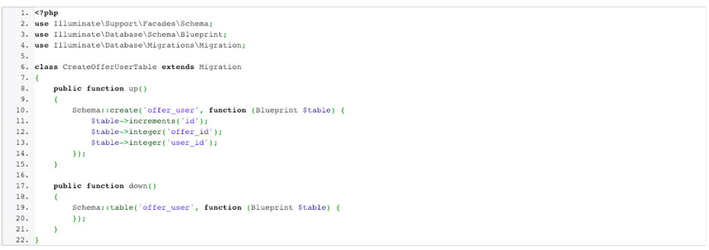
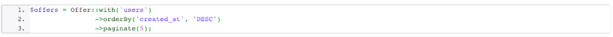

I’m a big fan of Eloquent and Laravel framework as well. Eloquent gives you a lot of opportunities to write really short and clean database queries.

Today I want to present many-to-many database relation in Laravel. I don’t like fake examples when I read some articles, so I present you code from my side project <a href="http://wyjechani.pl/" title="wyjechani.pl" target="_blank">wyjechani.pl</a> – which is application present travel offers where users votes for favourite offers.

User voting is many-to-many relation in that example. We have many user accounts on the website and single offer can have many votes from different users.

We need an additional database table to store single votes. We have to link user id with offer id. There is no vote range – user votes for offers which means we increase count of votes.

We need two models to represent User and Offer.

<i>app/Offer.php</i>

<i>app/User.php</i>

As you can see both of models belongsToMany themselves. Second parameter ‘offer_user’ is name of table which store that relation and we also declare ‘offer_id’ and ‘user_id’ which are names of columns in that table.

Now we need to create that table. We run php artisan make:migration create_offer_user_table and added our parameters in that migration. Our migration file should look like:

Now we can run php artisan migrate which adds new table to our database.

Now we can create VotesController with store method which get vote_id as parameter. In that method we check if the user is signed in. We find offer with vote_id and if it’s unique then we can use method declare in Offer model called users() and attach user id. It creates a record in our offer_user table. attach() is build in method to add relation, you can use detach() to remove specific relation as well.

Ok, that’s all, but you can ask yourself: ok, that’s awesome, but show me some advantages of that relation. Why should I use that?

The biggest advantage of that relation is our query to get offer data with votes and users which voted for specific offers. You can use a query like that:

Writing custom queries with raw SQL, a lot of join() methods can be really awful and can make your code dirty. Relations help you write understandable queries for other people. Eloquent is really great ORM and we should use that in an efficient way.

