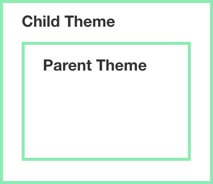
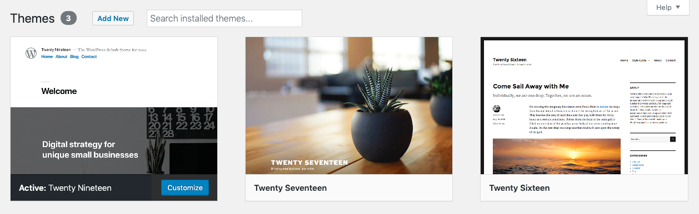
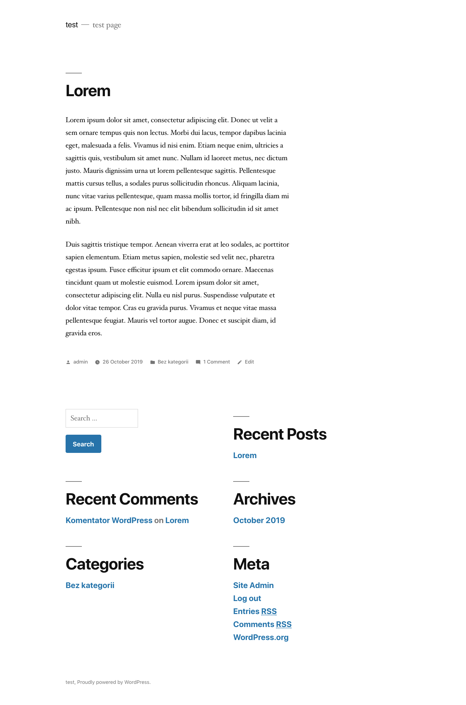
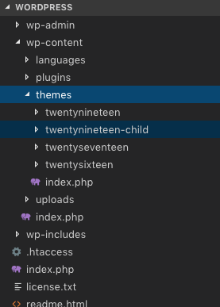
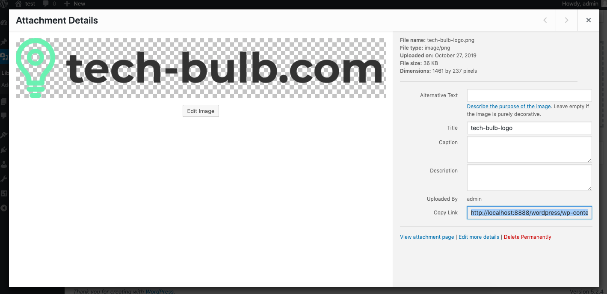
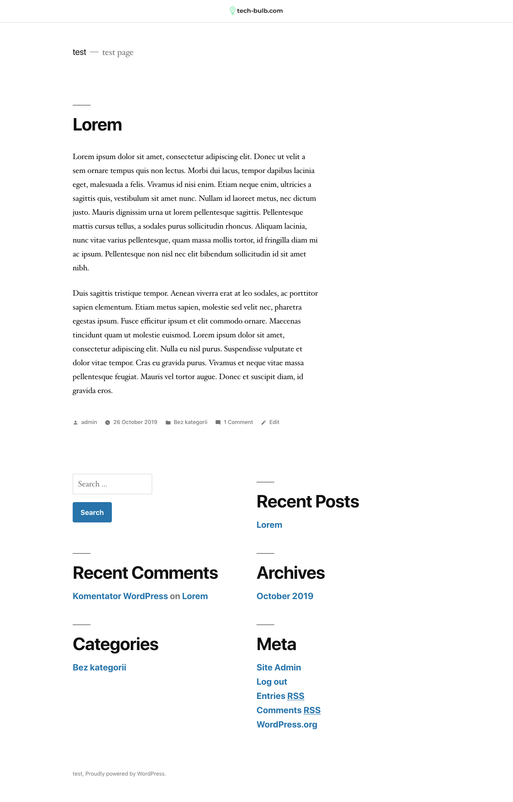

Hi, today I want to share with you some my thought about wordpress and how to making your job more joyful for you and people which will be working with your legacy code in the future. 

Last time I decided to help my friend with some “small” modifications to his website and I discovered that It was built with some popular themeforest wordpress theme and customized for his specification. The person which takes that job made all modifications in theme directory, take the cash and go happy.

“Ok dude, tricky title, but what’s wrong with editing theme source code? It works fine and everybody is happy.” - you can ask me.

“Everybody” is happy except person which will be working with that theme in the future. What can go wrong after editing some theme source code?

1. After wordpress version update all changes will disappear. When you buy some theme, make all superb customizations for your client inside that theme directory and then after some time somebody update wordpress version(which is important for security reasons) then wordpress “reinstall” your basic theme(without modifications) it will be that bought theme without any source code modifications. If you didn’t have any backup it’s pretty disaster.

2. Person worked with your legacy code doesn’t know which was changed in base theme

Child theme is overlay over your parent theme. If page is loaded wordpress read your child theme and then load all files not override from the parent theme. 

<h3>How to build child theme</h3>

I show how to build a child theme on default Twenty Nineteen theme example.

Default website with that theme installed looks like:

Let’s choose something to customize: I decided to add navbar at the top with logo in center position - I want to change header.php in our themes/twentynineteen.

1. Create a child theme directory. I like to call that {theme}-child. In our example, I make a directory called twentynineteen-child in themes directory.

2. Create style.css file in the child theme directory with a header similar to the code below. It’s required file to tell wordpress that it’s child theme.

<i>themes/twentynineteen-child/style.css</i>

<pre>
/*
    Theme Name: Twenty Nineteen Child
    Description: Twenty Nineteen Child Theme
    Author: Szymon Radosz
    Author URL: https://tech-buld.com
    Template: twentynineteen
    Version: 1.0.1
    Text Domain: twentynineteen-child
*/
</pre>

You should add your theme information.

Funny observation: If you declare Version with value 1.0.0 changes in your child theme style.css can doesn’t work! Add version to at least 1.0.1

3. Create empty functions.php file in your child theme directory. There is another required file.

4. Go to wordpress dashboard and activate your child theme. Now if you visit the website everything looks ugly, you ask yourself why you complicate your life if you can just make changes directly in parent theme and forget that dump blog post from that crazy guy who think about people working with your legacy code in the future, but don’t worry - child theme doesn’t load parent styles, because we don’t init that action in functions file.

5. Add code to functions.php file in a child theme

<i>themes/twentynineteen-child/functions.php</i>

<pre>
?php
    function enqueue_parent_styles() {
        // enqueue parent styles
        wp_enqueue_style( 'parent-style', get_template_directory_uri().'/style.css' );
    }

    add_action( 'wp_enqueue_scripts', 'enqueue_parent_styles' );
?>
</pre>

Now everything looks like in parent theme.

6. Add image to media library in wordpress dashboard and copy the path to image.

7. Copy header.php from the parent theme and add additional content to navbar.

<i>themes/twentynineteen-child/header.php</i>

<pre>
    div class="page-navbar">
       img src="<?php echo content_url() . '/uploads/2019/10/tech-bulb-logo.png' ?>" />
    /div>
</pre>

8. Add additional styles in child theme style.css

<i>themes/twentynineteen-child/style.css</i>

<pre>
.page-navbar {
    display: flex;
    align-items: center;
    justify-content: center;
    padding: 20px 0;
    border-bottom: 2px solid #e6e6e6;
}
.page-navbar > img {
    max-width: 150px !important;
}
</pre>

9. Now you make changes in your website and didn’t touch base theme source code. 

It was a short introduction how to modify your theme in a proper way. I hope it will help you make better quality job in wordpress. That nice CMS, but a lot of people make wordpress website rubbish. Try to think about people which will be working with your code in the future. Thank you for reading that. Have a nice day.

